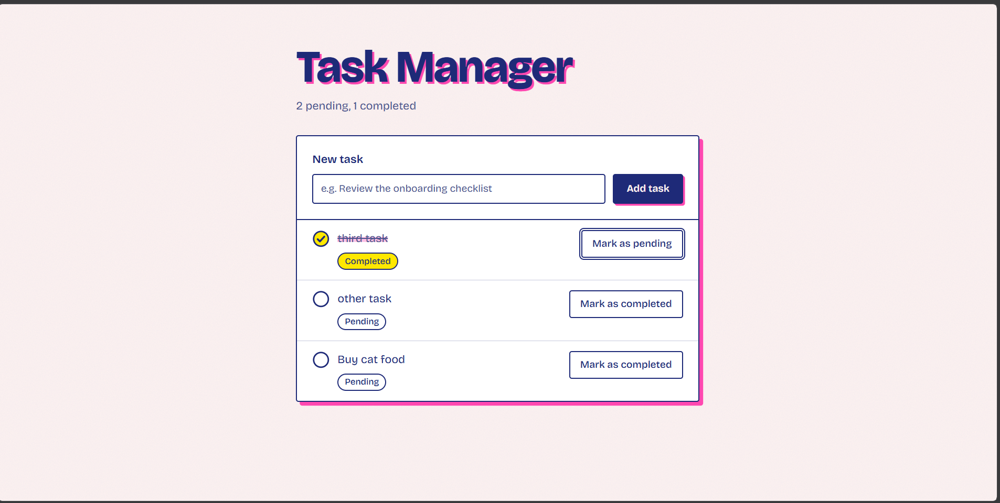
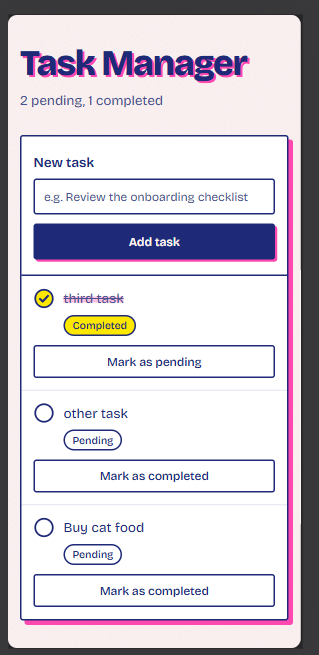

# Task Manager

[](https://github.com/Bubazombie/task-manager/actions/workflows/ci.yml)

A task manager with a Node.js + Express API and a Vue + Tailwind frontend. You can add tasks, see them listed with their status, and mark them as completed (or back to pending).





## Features

- Add a task with a title. New tasks start as pending.
- See all tasks with their title and status, newest first, plus a short summary ("2 pending, 1 completed").
- Mark a task as completed (the bonus), and set it back to pending if you clicked by mistake.
- Validation on both sides: titles are trimmed, required, and capped at 200 characters. The form shows a counter when you get close to the limit.
- Loading, empty, and error states, with a Retry button if the list fails to load.
- Works with keyboard and screen readers, and adapts from phone to desktop.

## Tech stack

- **Backend:** Node.js 24, TypeScript 6, Express 5, Zod 4. Tests with Vitest and Supertest.
- **Frontend:** Vue 3 (Composition API, `<script setup>`), TypeScript 6, Vite 8, Tailwind CSS 4. Tests with Vitest and Vue Test Utils.
- **Tooling:** npm workspaces, ESLint, Prettier, GitHub Actions.

## Setup

You need Node.js 24 (it's pinned in [`.nvmrc`](.nvmrc), so `nvm use` works).

```sh
git clone https://github.com/Bubazombie/task-manager.git
cd task-manager
npm install
npm run dev
```

That starts both apps:

- Frontend: http://localhost:5173
- API: http://localhost:3000

Everything runs from the repository root. No configuration is needed locally, but you can override the defaults by copying [`backend/.env.example`](backend/.env.example) (`PORT`, `CORS_ORIGIN`) or [`frontend/.env.example`](frontend/.env.example) (`VITE_API_BASE_URL`) to a `.env` file in the same folder. Invalid values stop the app at startup with a clear message.

| Script                 | What it does                                |
| ---------------------- | ------------------------------------------- |
| `npm run dev`          | Runs backend and frontend together          |
| `npm test`             | Runs the tests of both workspaces           |
| `npm run lint`         | Lints both workspaces                       |
| `npm run typecheck`    | Type checks both workspaces                 |
| `npm run build`        | Builds both workspaces                      |
| `npm run format:check` | Checks formatting (`npm run format` to fix) |

## API

Bodies are JSON. A task looks like this:

```json
{
  "id": "3f6c1a2e-8d4b-4e1f-9a7c-2b5d8e0f1a34",
  "title": "Review the onboarding checklist",
  "status": "pending"
}
```

| Method  | Path         | Body                     | Success                 |
| ------- | ------------ | ------------------------ | ----------------------- |
| `GET`   | `/tasks`     |                          | `200`, all tasks        |
| `POST`  | `/tasks`     | `{ "title", "status"? }` | `201`, the created task |
| `PATCH` | `/tasks/:id` | `{ "status" }`           | `200`, the updated task |

- `title` is trimmed and must have 1 to 200 characters.
- `status` is `"pending"` or `"completed"`. On create it's optional and defaults to `"pending"`.
- The `id` is a UUID generated by the server. Any field not listed above (including `id`) is rejected.
- `GET /tasks` returns tasks in creation order.

Every error uses the same shape:

```json
{
  "error": {
    "code": "VALIDATION_ERROR",
    "message": "Request validation failed",
    "details": [{ "field": "title", "message": "Title must not be empty" }]
  }
}
```

| Status | Code                | When                                                    |
| ------ | ------------------- | ------------------------------------------------------- |
| `400`  | `VALIDATION_ERROR`  | The body doesn't pass validation (`details` lists why)  |
| `400`  | `INVALID_JSON`      | The body isn't valid JSON                               |
| `404`  | `NOT_FOUND`         | Unknown task id or unknown route                        |
| `413`  | `PAYLOAD_TOO_LARGE` | The body is larger than 10 KB                           |
| `500`  | `INTERNAL_ERROR`    | Anything unexpected (logged on the server, not exposed) |

## Project structure

```text
backend/src/
  app.ts            createApp: middleware, routes, error handler
  server.ts         Wires the real dependencies and starts the server
  config.ts         Reads and validates environment variables
  errors/           Error middleware and NotFoundError
  tasks/            Schemas, router, controller, service, repository
frontend/src/
  types/            Task and error types (mirroring the API)
  api/              The only code that calls fetch
  composables/      useTasks: task state and actions
  validation/       Title rules, same as the backend
  components/       Form, list, list item, status badge and mark
  App.vue           Layout and screen reader announcements
```

## Testing

```sh
npm test
```

Tests live next to the code they cover (`*.test.ts`).

On the backend, every endpoint has integration tests with Supertest, including validation failures, malformed JSON, oversized bodies, unknown ids, and the generic 500. The service, the repository, and the config parsing have their own unit tests.

On the frontend, there are component tests for the form, the list, and each item, tests for the `useTasks` composable and the HTTP layer with the network mocked, and an `App` test for the main flows (adding a task and changing its status). They check what the user sees and does, not CSS classes.

The [CI workflow](.github/workflows/ci.yml) runs lint, typecheck, tests, build, and the format check on every push and pull request to `main`.

## Time spent

About 3 hours in total: roughly 20 minutes reading the assignment and planning, 2 hours 25 minutes building (setup, backend, frontend, and CI), and 15 minutes on this README. The commit history matches this.

## Design decisions

### One repo, two workspaces

Backend and frontend live in the same repository as npm workspaces. One `npm install` and one `npm run dev` get everything running, which matters when someone is reviewing the project for the first time. TypeScript runs in strict mode on both sides.

### A layered backend

A request goes through the router, the controller (validates input and shapes the response), the service (business rules, like the default status), and the repository (data access). The service only knows about a `TaskRepository` interface, so the in-memory storage could be swapped for a database without touching anything above it. That's also why the interface is async, even though the in-memory version doesn't need to be.

`createApp` receives its dependencies instead of creating them. `server.ts` passes the real ones, and each test builds its own app with a fresh repository, so tests never share state.

### Validation and errors

The Zod schemas in `task.schemas.ts` are the single source of truth: status values, title rules, and the TypeScript types all come from there. They're strict, so if a client sends an `id` or a typo'd field, it gets a clear 400 instead of the field being silently ignored.

All errors go through one middleware and come out with the same shape and a stable `code`, so the frontend can react to the code instead of parsing messages. I made sure an oversized body returns a 413 instead of falling into a generic 500, and that internal errors are logged without leaking details to the client.

### API choices

The bonus asks for "Mark as Completed", but I let `PATCH /tasks/:id` accept both statuses, because a misclick should be easy to undo. Ids are UUIDs generated by the server, so clients can't pick or collide them. Storage is in memory, as the assignment allows, which means data resets when the backend restarts.

### Frontend structure

The frontend is split the same way: `types/` mirrors the API, `api/` is the only place that talks to the network, `useTasks` holds the state and the actions, and components just receive props and emit events. Components never know about HTTP, which keeps them easy to test.

The list only changes after the server confirms an action. I preferred that over optimistic updates here, so the screen never shows something the server rejected. While a request is in flight, its button shows it.

### Accessibility

- Every input has a visible label, and errors are linked to their field.
- Adding a task or changing its status is announced to screen readers, and errors are announced as alerts.
- The status button uses `aria-disabled` instead of `disabled` while its request runs, because a disabled button loses keyboard focus.
- After adding a task, focus goes back to the input so you can keep typing.
- Status is always written as text, not shown only with color or an icon.
- Color contrast meets WCAG AA, and the one animation is skipped for users who prefer reduced motion.

### Visual design

I didn't want this to look like every other task list template. The design is inspired by risograph printing: flat inks (navy, fluorescent pink, and yellow), hard offset shadows like a slightly misaligned print, a light paper grain, and a pink marker stroke that crosses out a task when you complete it. That stroke is the only animation in the app. The default Tailwind palette is removed in the theme, so only these colors can be used.

### Few dependencies

No UI kit, no state library, no HTTP client. For one list, a composable is enough state management, and `fetch` is enough HTTP. Less to install, audit, and explain.

TypeScript is pinned to 6.0 because typescript-eslint doesn't support TypeScript 7 yet.

## AI use

The assignment allows AI tools, so here is exactly how I used them.

I worked with two: Claude in a chat window, to plan the work, think through decisions, review plans, and write prompts, and Claude Code in the terminal, which wrote most of the code.

Before any code existed, I wrote [`CLAUDE.md`](CLAUDE.md). It sets the rules the agent follows in this repo: propose a plan and wait for my approval before coding, never run git commands, pass lint, typecheck, tests, build, and the format check before calling anything done, and say so honestly when something isn't verified.

Every stage (setup, backend, frontend, CI) went the same way: Claude Code proposed a plan, I reviewed it, changed what I didn't agree with, and only then let it implement. Some of the calls I made along the way:

- Removed Oxlint, which the Vue generator now adds by default, to keep a single linter.
- Pinned TypeScript to 6.0 when it turned out typescript-eslint doesn't support 7.
- Rejected the plan's handling of oversized bodies (a generic 500) and asked for a proper 413.
- Asked for strict schemas, so unknown fields like `id` are rejected.
- Threw out the proposed visual design, which looked like a generic template, and replaced it with the risograph direction.

I reviewed each stage, tested the app by hand in the browser on desktop and mobile, and made every commit myself.

The AI was fast and good at catching details I might have missed, like normalizing a CORS origin with a trailing slash or keeping keyboard focus on a button while its request runs. Where I had to step in was scope, architecture, UX, and the visual direction.

## Improvements

With more time, I would:

- Add a real database behind the existing repository interface, so tasks survive restarts.
- Share the API contract between backend and frontend (a shared package or OpenAPI-generated types), so the frontend types can't drift from the backend schemas.
- Let users edit and delete tasks.
- Add end-to-end tests with Playwright, running the real browser against the real backend.
- Deploy it with a live demo, so it can be tried without installing anything.
- Self-host the font instead of loading it from Google Fonts.
- Fix the npm audit warning in the lint tooling (dev only) once there's an upstream fix, instead of forcing a breaking downgrade now.
